# write-notes-like-deepseek

> **像 DeepSeek 团队一样维护项目。** 把他们在 [DeepSeek Harness](https://github.com/deepseek-ai/deepseek-harness) 里用的那套方法，装进你的仓库。

[](https://agentskills.io)
[](https://czm15053.github.io/write-notes-like-deepseek-demo/)
[](LICENSE)

AI 每天都能帮你交十几个 PR，但每个新会话都是一张白纸，看不见仓库里已经立过的规矩。DeepSeek 团队用写在仓库里的笔记解决这件事；本项目把这套方法做成 Skill，装上就能按同样的方式维护你的项目。

```bash
npx skills add czm15053/write-notes-like-deepseek
```

📺 先看效果：[在线演示看板](https://czm15053.github.io/write-notes-like-deepseek-demo/)（内置 974 篇来自 DeepSeek Harness 的真实决策笔记，可脱机浏览）

---

## 当 AI 每天帮你交十几个 PR，代码库会怎样失控

<p align="center">
  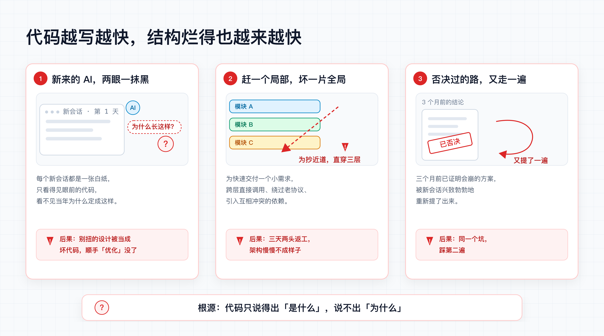
</p>

代码越写越快，结构烂得也越来越快——这是 AI 密集编码时代的新问题：

1. **新来的 AI 看不见当初为什么这样定。** 每个新会话都是一张白纸，只看得见眼前的代码。一段写得很别扭的代码，往往是当年为了避免死锁、为了兼容某个约束故意为之；AI 不知道，就会自作聪明地「优化」掉它。
2. **为赶一个局部需求，打穿全局结构。** AI 极其擅长单点突破，但没有全局视野：跨层直接调用、绕过老协议、引入互相冲突的依赖，一天一个坑。
3. **被否过的老路被一遍遍重新提出。** 三个月前已经证明会内存溢出的方案，新会话又兴致勃勃地提了一遍——因为没人把「这条路试过了，不行」写下来。

根源只有一句话：**代码只能表达「系统现在怎么跑」，表达不了「为什么必须这样跑、以及放弃了什么」。**

靠提示词提醒 AI「请注意架构」是没有用的。DeepSeek Harness 团队在自己的代码库里验证过：**coding agent 遵守「被强制的门」的可靠性，远高于遵守散文式约定**——而且干活的劳动力已经是 AI，「做门禁太麻烦」这个理由本身就不成立。

所以规矩必须写成 AI 绕不开的形式：和代码**同仓库**（必然读到）、**同一次改动**（必然同步）、**机械校验**（必然遵守）、旧决定**封存带封印**（篡改了会报警）。

### 装上它之后：AI 从「代码推土机」变回「懂规矩的搭档」

<p align="center">
  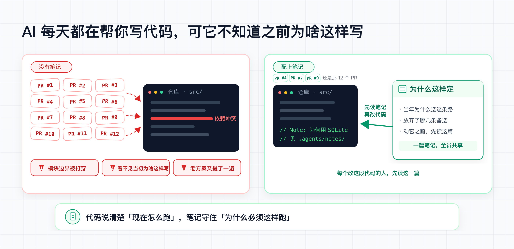
  <br>
  <em>左边没有笔记：每天十几个 PR 把仓库冲乱。右边有笔记：同样的代码库按规矩改。</em>
</p>

**没有它时：**

> **你**：「给插件加个实时进度通知。」
> **AI**：「已完成：在宿主内核新增 `getProgress()` 方法，所有插件可直接调用 ✅」
>
> 三个月后：四个插件绕开消息通道直连内核，微内核成了乱炖——而当初那个「多此一举」的消息通道约定，已经没人记得为什么。

**装上它后：**

> **你**：「给插件加个实时进度通知。」
> **AI**：「这涉及跨插件通信。仓库笔记里立着规矩：所有跨插件通信必须走消息通道，哪怕多一层序列化开销。我已在 `proposed/` 按这个约束起草了方案，对比了两条备选，请你过目后再施工。」

一句台词的差别：动手之前，先看见当初为什么这样定。

---

## 它是怎么转起来的：三步闭环

<p align="center">
  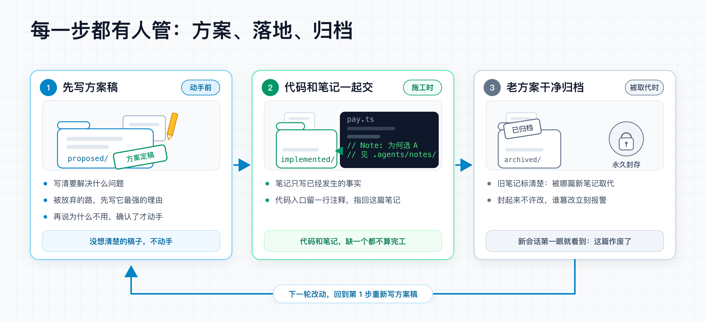
</p>

1. **动手前，先写方案稿**（放进 `proposed/`）：要解决什么问题、考虑过哪几条路——每条被放弃的路，先写它**最强的理由**，再解释为什么不用。想清楚后施工（有评审就走评审，一个人写就自己拍板）。
2. **代码和笔记一起交**：落地后方案稿转为 `implemented/`，只许用现在时写「已经发生的事」（门禁只拒提案标题）。
3. **老方案被取代时，干净归档**：新笔记接管并承继旧理由；能删则删，否则物理移入 `archived/` 并只插一行 `Archived:`——是源码级的归档，不是改个状态字段。互链写在新笔记里。

   封存是机械的，不靠自觉：

   - 每篇归档笔记记入 `manifest.json` 的 SHA-256 封印，此后**只增不改**——谁动了归档里的一个字，校验当场报警；
   - **死链不过夜**：归档那一刻，脚本列出所有还链着旧笔记的引用清单，逐条修完才算完；
   - 旧笔记从此不参与日常校验，但也永远不会丢——新会话再想走回头路，会先撞见归档快照和新笔记里的互链。

---

## 什么样的决定值得记

<p align="center">
  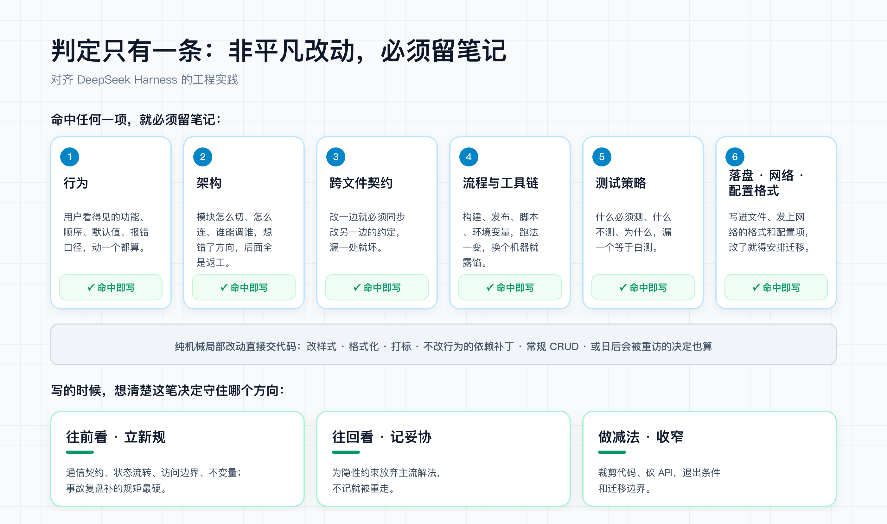
</p>

**判定对齐 DSH：非平凡改动必须留笔记。** 改了**行为**、**架构**、**跨文件契约**、**流程与工具链**、**测试策略**，或**落盘 / 网络 / 配置格式**——命中任何一项就写；其他维护者日后可能重访的决定，也一样。纯机械性的局部改动（改样式、格式化、打标、不改行为的依赖补丁、常规 CRUD）直接交代码，不用记。

**写的时候，想清楚这笔决定守住哪个方向：**

- **往前看：给系统立新规。** 新的跨模块通信契约、状态流转规则、访问边界、运行时不变量——比如「所有跨插件通信必须走消息通道」「会话日志一旦写入就不可变」。不写下来，后来的 AI 各写一套、随意击穿模块。事故复盘后补的锁粒度、连接池规矩也属于这类，是最硬的新规。
- **往回看：为看不见的约束做过的妥协。** 为了零依赖开箱即用，坚决不引入外部常驻进程；为了崩溃可恢复，宁可放弃内存缓存。当年放弃的往往是更主流、更直觉的解法——不写下来，后来的人只看见「慢」和「土」，把被否掉的路重走一遍。
- **做减法：收窄暴露面、废弃旧东西。** 删代码、砍 API、下线旧流程——退出条件和迁移边界光看代码看不出来。不写下来，没人敢删第二刀；或者删过了头，把还在用的东西一起砍掉。

**不用记的**：改样式、格式化、打个版本号、不改行为的依赖补丁和常规 CRUD——直接提交代码，别给自己加戏。过度留痕和完全不记，是同一个错误的两种样子。

<p align="center">
  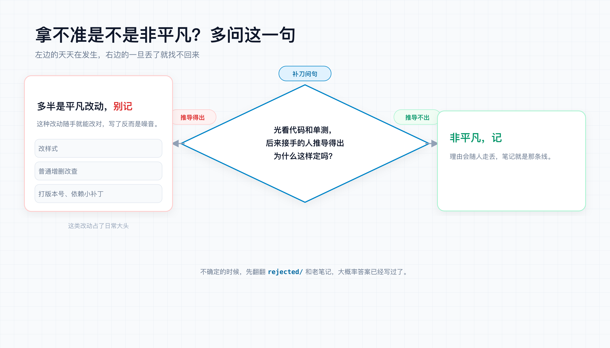
</p>

### 规矩不能只靠自觉

> 对 AI 来说，写在散文里的规矩，等于没有规矩。

DeepSeek Harness 团队在自家代码库里立过这条元规矩：**agent 遵守被强制的门，远胜于遵守散文式约定**。所以这套系统里，几乎每条纪律都有机械牙齿：

- 笔记必须有备选方案、implemented 不许留提案标题 → 校验脚本非零退出，红给你看；
- 目录和类别不许自造 → 树校验直接拦下「第七种分类」；
- 老决定封存 → SHA-256 封印只增不改，篡改当场报警。

Prompt 只负责提醒，脚本负责咬合。你不需要相信 AI 的自觉，只需要相信非零退出码。

---

## 一篇笔记长什么样

摘自 DeepSeek Harness 现行笔记（有删节）：`.agents/notes/implemented/process/2026-07-26-dependencies-over-hand-rolling.md`

```markdown
# Agent Note: 优先选用持续维护的依赖，而非手写实现

Status: implemented

## Problem

仓库没写依赖政策，agent 从「外部依赖很少」推断出「不要加依赖」，比任何人实际决定过的都严。手写的 SSE 解析器、协议分帧器、重试循环，每一份都要自己测、自己审，却吃不到生态已经修过的边界情况。

## Decision

引入维护良好的外部依赖（或引擎下限已提供的 Node 内置）来替换手写实现，是正当的简化。门槛：净删除我们维护的代码；包要健康；语义要契合；不重开已定案的 seam。

## Alternatives considered

- **维持隐性的「不加新依赖」文化** — 最省事，但它从来不是一项有记录的决策；代价是手写协议和解析代码重复实现久经实战的库，评审还得重推一遍生态已修过的边界。
- **一份获批包的硬性白名单** — 看起来可控。但仓库还在预发布、依赖集合很小；按 PR 设证据门槛再加评审，不必再养一份白名单。
- **每个新依赖都像 Cordis 一样以源码收录** — 能打补丁、能锁死上游。但 vendor 只适用于必须打补丁或锁定的包；推广到所有依赖，等于把本要卸下的维护负担再背回来。

## Consequences

- **收益**：巡查简化时，「用包 Y 替换手写的 X」算正规产出。
- **代价**：依赖清单会增长，供应链接触面随之扩大；扫描和更新节奏另有提案管。
```

三个要点：**被放弃的方案先写最强理由再否决**（防止后人翻案）；**收益和代价都写**（没有代价的决定是挑选过的）；**只写已经发生的事**——`## Decision` 用现在时；门禁只拒提案标题，不扫正文用词。

<p align="center">
  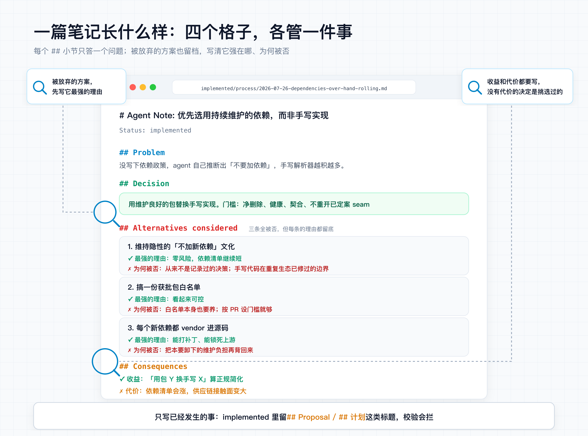
</p>

---

## 目录就是状态，没有总索引

路径格式严格遵循：`{走到哪一步}/{哪一类}/yyyy-mm-dd-主题.md`

```
.agents/notes/
├── proposed/       # 动手前：方案稿，写清背景、备选与验收标准
├── implemented/    # 已落地：只写现在时事实，随代码一起改
├── rejected/       # 被否决：写明原因防重犯，没价值就删
└── archived/       # 已封存：完成使命的旧决定，永久只读，改了会报警
```

笔记分六种，不许自造类别（校验脚本会拦）：

<p align="center">
  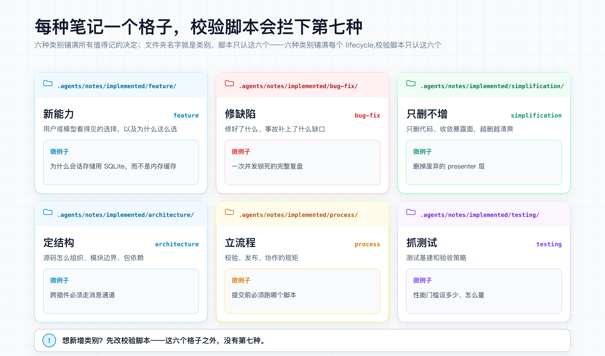
</p>

- `feature`：用户看得见的新能力和产品选择。
- `bug-fix`：缺陷修复，或事故复盘补上的架构缺口。
- `simplification`：**只删不增**——清理废弃逻辑、收敛暴露面；行为不变的普通重构归这里。
- `architecture`：源码怎么组织、模块边界、包依赖。
- `process`：围着代码转的工具链、校验、发布流程。
- `testing`：测试基建、分层与验收策略。

<p align="center">
  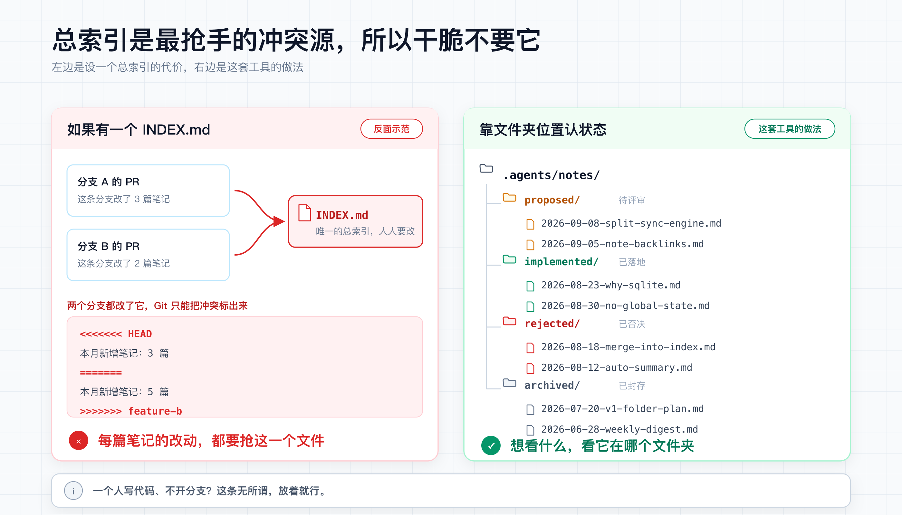
</p>

**为什么没有一个总的 INDEX.md？** 因为多分支、多人同时开发时，总索引是最抢手的冲突源——每篇笔记的改动都要碰它。文件夹位置本身就是状态：想看待审方案看 `proposed/`，想看踩坑记录看 `rejected/`，配合全文搜索足够。（一个人写代码、不开分支？这条无所谓，放着就行。）

### 个人写、团队写，差别只在加多少流程

<p align="center">
  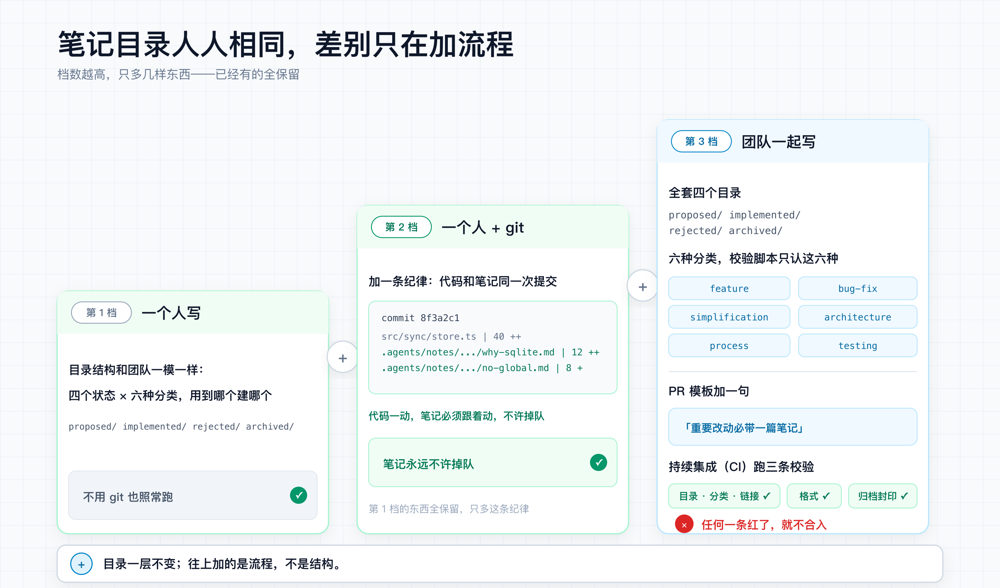
</p>

**所有人的笔记目录长一个样**：`proposed / implemented / rejected / archived × 六种分类`，与 DSH 对齐的硬结构，不分个人还是团队。差别只在往上叠加多少流程：

| 你的处境 | 在相同底座上加什么 |
|---|---|
| **一个人写** | 不加。目录结构照标准建，装上 Skill 就开写；不用 git 也照常跑。 |
| **一个人 + git** | 加一条纪律：代码和笔记**同一次提交**，不让笔记掉队。 |
| **团队开发** | 加评审、PR 模板提一句「重要改动必带一篇笔记」、CI 接上 `verify-notes` 三条校验（见下节）。 |

---

## 本地校验：零依赖，`npx` 直接跑

> 校验脚本只依赖 Node.js ≥ 18。可以拷贝 `scripts/` 目录进任何项目，也可以让 Agent 随手执行。

```bash
# 1. 目录、类别、文件名、笔记之间的相对链接
npx tsx scripts/verify-agent-note-tree.ts

# 2. 头部与骨架：状态行、必备小节、备选方案必填、implemented 禁用提案标题
npx tsx scripts/verify-agent-note-format.ts

# 3. 封存区体检：归档笔记的头部布局、封印哈希、只增不改（没有 git 自动降级）
npx tsx scripts/verify-archived-agent-notes.ts

# 4. 老方案被取代，一键归档：只插 Archived: 一行 + 封印 + 列出谁还链着它
#    --superseded-by 在新笔记里补互链，不写进归档篇
npx tsx scripts/archive-agent-note.ts .agents/notes/implemented/<类别>/<文件名>.md \
  --superseded-by .agents/notes/implemented/<类别>/<新笔记>.md

# 5. 可选体检（只提醒不报错，不进 CI）：代码里若有 // Note: 锚点，是否指着不存在的笔记
npx tsx scripts/check-note-anchors.ts
```

配进 `package.json`：

```json
{
  "scripts": {
    "verify-notes": "npx tsx scripts/verify-agent-note-tree.ts && npx tsx scripts/verify-agent-note-format.ts && npx tsx scripts/verify-archived-agent-notes.ts",
    "archive-agent-note": "npx tsx scripts/archive-agent-note.ts"
  }
}
```

团队场景可以直接抄本仓库的 [.github/workflows/verify-notes.yml](.github/workflows/verify-notes.yml)，每次推代码和提 PR 时自动跑前三个校验。

### 装上 Skill 之后

```bash
npx skills add czm15053/write-notes-like-deepseek
```

把以下规则加入项目的 `AGENTS.md` 或 `CLAUDE.md`，AI 就会自动遵守：

```markdown
## 重要改动必须留笔记

1. 非平凡改动（改了行为、架构、跨文件契约、流程与工具链、测试策略、落盘/网络/配置格式）前，遵循 .agents/skills/write-notes-like-deepseek/SKILL.md 写或更新笔记；机械性小改（样式、格式化、打标、不改行为的补丁）直接提交。
2. 写之前先检索 .agents/notes/ 里的同主题旧笔记：有归属就地更新；新想法先放 proposed/，落地随同代码改动转 implemented/；新方案彻底取代旧决策时，同批归档旧篇并标明被谁取代。
3. 被放弃的方案先写它最强的理由，再解释为什么不用。
4. 提交前跑 npm run verify-notes，红了先修再交。
```

**日常使用就一句话**——像平时一样提需求，改动大的时候点名让它先立笔记：

```text
把鉴权模块从 Session 重构成 JWT，改动比较大，
动手前先按 write-notes-like-deepseek 立一篇 Note。
```

AI 会自动在 `proposed/` 输出结构化提案（背景、备选及各自的最强理由、验收标准），等你确认后施工；代码落地时，笔记随同转为 `implemented/`。

---

## 辅助工具：决策看板

不是必需品，只是个顺手的观察窗：一条命令生成单文件 `board.html`，双击就能看——**被引用最多的那几篇笔记**（就是这套系统里最怕碰的决定）、所有被否决方案的避坑清单、按月份的演进时间线。日常开发中它直读本地笔记目录，改了笔记切回浏览器就自动刷新；也可以打包成单文件发到网上（[在线演示](https://czm15053.github.io/write-notes-like-deepseek-demo/)就是这么来的）。

```bash
npx tsx scripts/build-board.ts --init board.html "项目决策看板"     # 本地直读，热更新
npx tsx scripts/build-board.ts --bundle .agents/notes demo.html "项目决策看板"  # 打包分发
```

真实界面（来自内嵌 DeepSeek Harness 974 篇真实笔记的[在线演示](https://czm15053.github.io/write-notes-like-deepseek-demo/)）：

<p align="center">
  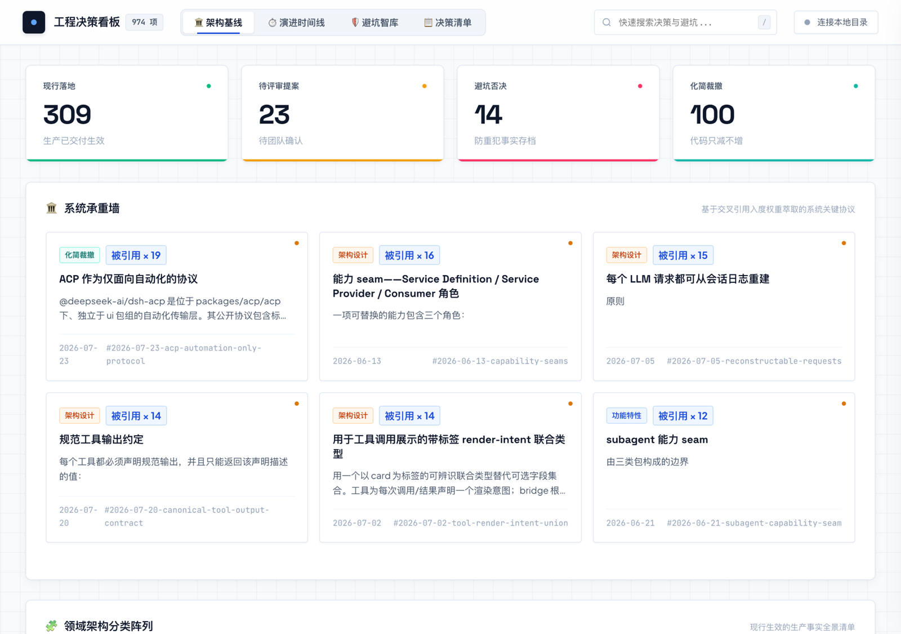
</p>

点开任意一篇笔记，阅读原文、被放弃方案的最强理由与血缘链路：

<p align="center">
  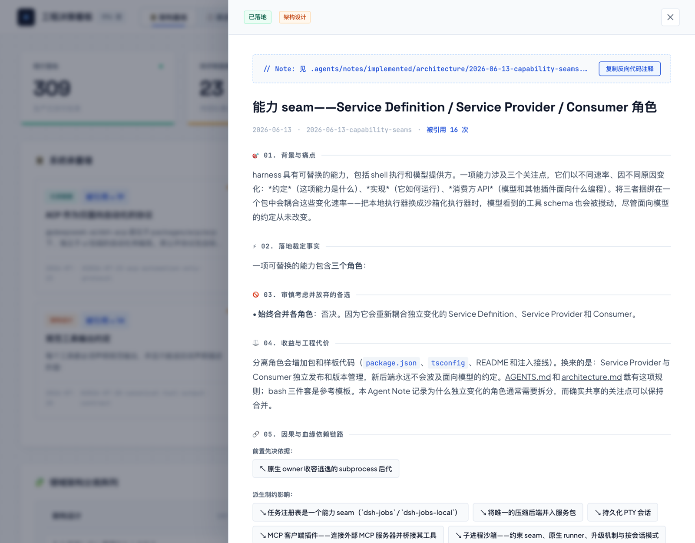
</p>

「避坑智库」汇总了全库被放弃的方案——每一条都先写它最强的理由，再写为什么不用：

<p align="center">
  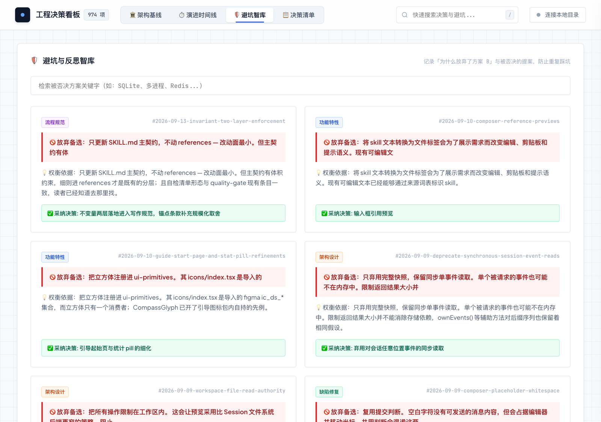
</p>

按月份与分类切片，回看全部笔记铺开的演进轨迹：

<p align="center">
  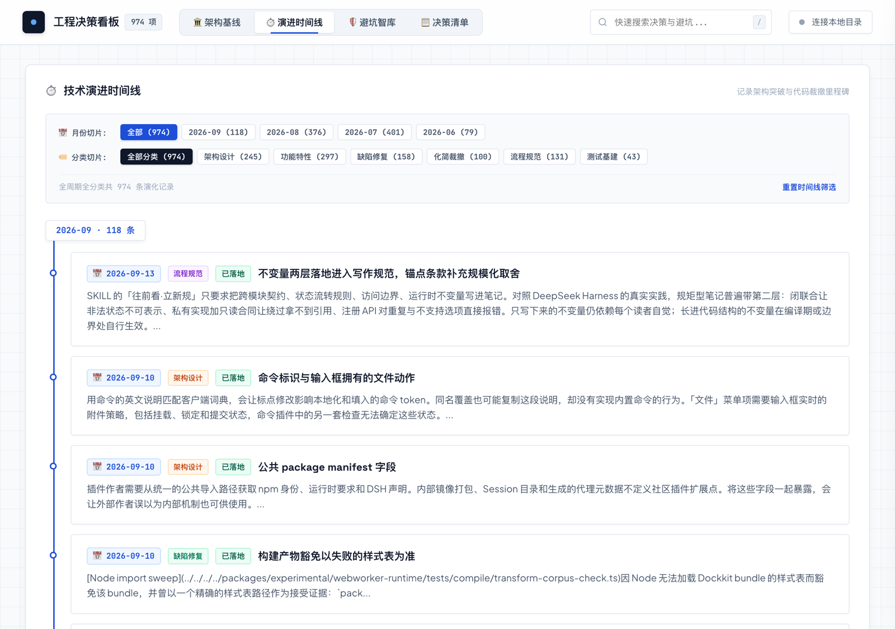
</p>

---

## 仓库导览

- [`SKILL.md`](SKILL.md)：装给 AI 的主契约——先判「要不要写」，再谈怎么写。
- [`templates/`](templates/)：`proposed` / `implemented` / `rejected` 三份填空模板。
- [`references/when-to-write.md`](references/when-to-write.md)：什么时候写、什么时候原地改、什么时候归档。
- [`references/archiving.md`](references/archiving.md)：封存规矩——被取代的老决定怎么干净归档。
- [`references/quality-gate.md`](references/quality-gate.md)：写完笔记后的语义自检清单。
- [`references/verification.md`](references/verification.md)：每个校验脚本在查什么、为什么。


## 友情链接

- [LinuxDo](https://linux.do) — 真诚、友善、团结、专业，你的品质开源与技术社区

## 许可证

[MIT](LICENSE)
